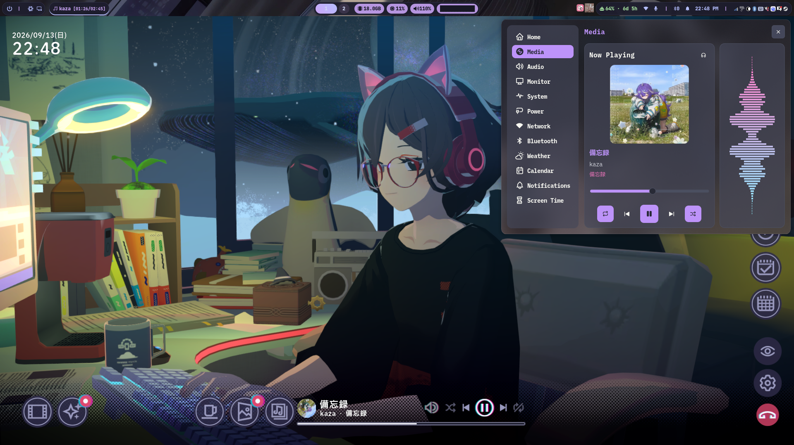

# Chill With You and Spotify

Windows 版「Chill with You Lo-Fi Story」を Proton で起動し、 BepInEx を通じて、 Spotify と Chill with You の連携用のプラグインと bridge を起動します。


## 導入

```sh
nix run path:.#install       # BepInEx と通常衣装固定プラグインを配置
nix profile add path:.      # 起動ラッパーをインストール
```

標準の Steam ライブラリ以外にインストールしている場合は、`Chill With You.exe` があるフォルダーを渡します。

```sh
nix run path:.#install -- '/path/to/Chill with You Lo-Fi Story'
```

Steam のプロパティで、このゲームの起動オプションを次に設定します。

```text
/home/username/.nix-profile/bin/chill-with-you-modded %command%
```
ラッパーが、この起動にだけ `winhttp` の DLL override を設定します。

## 通常衣装の固定

`settings.nix` の `defaultOutfit = true;` で、日替わりの衣装を通常のジャケット姿に固定します。Spotify とは独立したプラグインで、Chirarism Satone 自体は各自で導入してください。

ゲームを終了してから導入コマンドを実行してください。Spotify も使う場合は `nix run path:.#plugin-install` で両プラグインを導入します。`#install` は Spotify プラグインを含まない構成に更新します。

固定を解除するには `defaultOutfit = false;` に変更し、同じ導入コマンドを再実行します。手動導入した MOD は保持されます。

## リリース

GitHub Actions はテスト後に `ChillSpotify.dll` と `ChillDefaultOutfit.dll` をビルドします。`v` で始まるタグを push すると GitHub Release を作成し、両方の DLL を添付します。

plugin のコンパイルにはゲームの Managed DLL が必要です。GitHub リポジトリに次の Repository Variables を設定してください。

- `GAME_ASSEMBLIES_URL`: Managed DLL を収録した ZIP の公開 URL
- `GAME_ASSEMBLIES_SHA256`: ZIP の SHA-256

ZIP 内には `Assembly-CSharp.dll` を1つだけ含め、そのファイルと同じディレクトリにコンパイルで参照するすべての DLL を配置してください。ゲーム由来の DLL は Release には含まれません。
